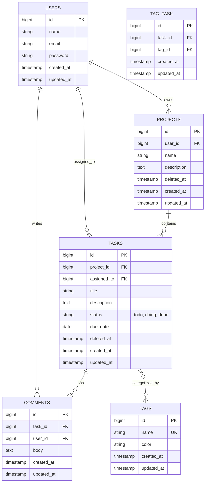

# Database ERD - Mini Trello

```mermaid
erDiagram
    USERS ||--o{ PROJECTS : owns
    USERS ||--o{ TASKS : assigned_to
    USERS ||--o{ COMMENTS : writes
    PROJECTS ||--o{ TASKS : contains
    TASKS ||--o{ COMMENTS : has
    TASKS }o--o{ TAGS : categorized_by

    USERS {
        bigint id PK
        string name
        string email
        string password
        timestamp created_at
        timestamp updated_at
    }

    PROJECTS {
        bigint id PK
        bigint user_id FK
        string name
        text description
        timestamp deleted_at
        timestamp created_at
        timestamp updated_at
    }

    TASKS {
        bigint id PK
        bigint project_id FK
        bigint assigned_to FK
        string title
        text description
        string status "todo, doing, done"
        date due_date
        timestamp deleted_at
        timestamp created_at
        timestamp updated_at
    }

    TAGS {
        bigint id PK
        string name UK
        string color
        timestamp created_at
        timestamp updated_at
    }

    TAG_TASK {
        bigint id PK
        bigint task_id FK
        bigint tag_id FK
        timestamp created_at
        timestamp updated_at
    }

    COMMENTS {
        bigint id PK
        bigint task_id FK
        bigint user_id FK
        text body
        timestamp created_at
        timestamp updated_at
    }
```
